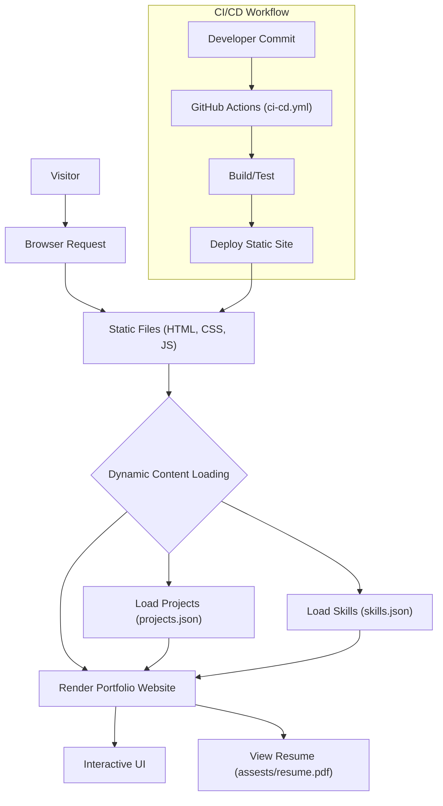

# 🚀 Dynamic Portfolio Website

<p align="center"></p>

## Short Description
Unveiling a beautifully crafted and highly responsive personal portfolio website, meticulously designed to showcase skills, projects, and professional experience. This repository provides a modern, interactive, and easy-to-navigate platform for developers to present their work, backed by a robust CI/CD pipeline for seamless deployment.

## ✨ Key Features
*   **Stunning UI/UX:** A modern, visually appealing design with smooth animations and interactive elements.
*   **Responsive & Adaptive:** Flawlessly adapts to any screen size, from desktops to mobile devices, ensuring an optimal viewing experience.
*   **Project Showcase:** Dedicated section to highlight your key projects with detailed descriptions and visuals.
*   **Experience Timeline:** A clear, chronological overview of your professional journey and achievements.
*   **Skills & Expertise:** Dynamic display of your technical skills, organized for easy understanding.
*   **Downloadable Resume:** Provides a convenient option for visitors to download your resume directly.
*   **CI/CD Integration:** Automated build and deployment workflows via GitHub Actions ensure code quality and rapid updates.
*   **Interactive Backgrounds:** Leverages `particles.min.js` for captivating background effects.
*   **Error Handling:** Custom 404 page for a polished user experience.

## Who is this for?
This project is ideal for:
*   **Developers & Designers:** Looking for a solid foundation to build or enhance their personal brand and showcase their portfolio.
*   **Students:** To create a professional online presence for job applications and academic presentations.
*   **Freelancers:** To present their work, services, and expertise to potential clients.
*   **Anyone** seeking a modern, maintainable, and impressive way to display their professional identity online.

## Technology Stack & Architecture
This portfolio is built on a robust, lightweight, and modern web stack:

*   **Frontend:**
    *   **HTML5:** For structuring the content.
    *   **CSS3:** For styling and responsive design (`assests/css/style.css`, `assests/css/404.css`).
    *   **JavaScript:** For interactivity and dynamic content (`assests/js/app.js`, `assests/js/script.js`, `assests/js/particles.min.js`).
*   **Data Management:**
    *   **JSON:** Used for managing project details (`projects/projects.json`) and skills (`skills.json`), making content updates straightforward.
*   **Automation & Deployment:**
    *   **GitHub Actions:** Configured for Continuous Integration and Continuous Deployment (`.github/workflows/ci-cd.yml`), enabling automated builds and deployments on every push.
*   **Assets:**
    *   Comprehensive collection of images and a downloadable resume (`assests/images/`, `assests/resume.pdf`).

## 📊 Architecture & Database Schema
This is a static, client-side rendered portfolio, meaning there's no backend server or traditional database. All content is delivered directly from the browser, leveraging JSON files for structured data.



## ⚡ Quick Start Guide

Getting your own local copy of this portfolio website up and running is incredibly simple:

1.  **Clone the Repository:**
    ```bash
    git clone https://github.com/manisanthosh445/portfolio_website.git
    cd portfolio_website
    ```
2.  **Open in Browser:**
    Simply open the `index.html` file in your preferred web browser. All content is served statically, no local server required!
    ```bash
    # Example for macOS/Linux (might vary)
    open index.html
    # For Windows, navigate to the folder and double-click index.html
    ```
3.  **Customize Your Content:**
    *   Modify `projects/projects.json` to add or update your project details.
    *   Edit `skills.json` to showcase your technical proficiencies.
    *   Update `assests/resume.pdf` with your latest resume.
    *   Personalize `index.html`, `experience/index.html`, `projects/index.html` and the CSS/JS files to match your brand and style.

## 📜 License
This project is licensed under the MIT License - see the [LICENSE](LICENSE) file for details.